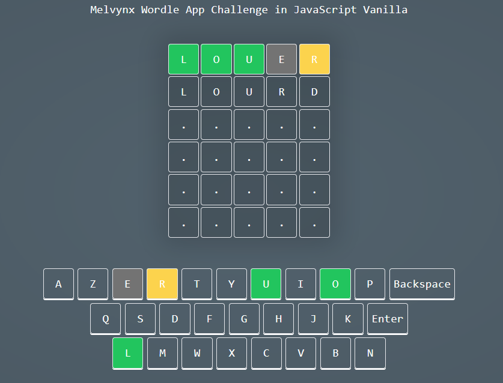

Here's the updated README.md in English:

---

# Wordle in Vanilla JavaScript

This project is an implementation of the Wordle game in Vanilla JavaScript. Wordle is a word guessing game where the player must guess a mystery word within a certain number of attempts. Each attempt by the player is compared to the mystery word, and hints are given to indicate correct and misplaced letters.

## Features

- Simple and user-friendly user interface.
- Ability to guess words within a limited number of attempts.
- Indication of correct and misplaced letters after each attempt.
- Reset functionality to start a new game.
- Confetti effects to celebrate victory.

## How to Play

1. Type a five-letter word into the provided boxes.
2. Validate your guess by pressing the "Enter" key.
3. Correct and misplaced letters will be indicated after each attempt.
4. Continue guessing until you find the mystery word or exhaust all attempts.
5. Use the "Reset" button to start a new game.

## Installation

To install and run this project locally, follow these steps:

1. Ensure you have Node.js installed on your system. If not, you can download and install it from the official website: [Node.js](https://nodejs.org/).

2. Clone this GitHub repository to your local machine using the following command:

   ```
   git clone <repository_URL>
   ```

   Replace `<repository_URL>` with the actual URL of the GitHub repository.

3. Navigate to the project directory using the following command:

   ```
   cd project_directory
   ```

   Replace `project_directory` with the name of the directory where you cloned the repository.

4. Install the project dependencies by running the following command:

   ```
   npm install
   ```

5. Once the installation of dependencies is complete, start the application in development mode by running the following command:

   ```
   npm run dev
   ```

6. Open your web browser and go to the following URL: `http://localhost:3000` to play the Wordle game.

That's it! You have now installed and run the project locally on your machine. Enjoy playing Wordle!

## Screenshot



## Technologies Used

- Tailwind CSS
- Vite.js
- JS-Confetti
- JavaScript

## Contribution

Contributions are welcome! If you'd like to contribute to this project, feel free to submit a pull request.

## Author

This project was created by [if-web-dev](https://github.com/if-web-dev).